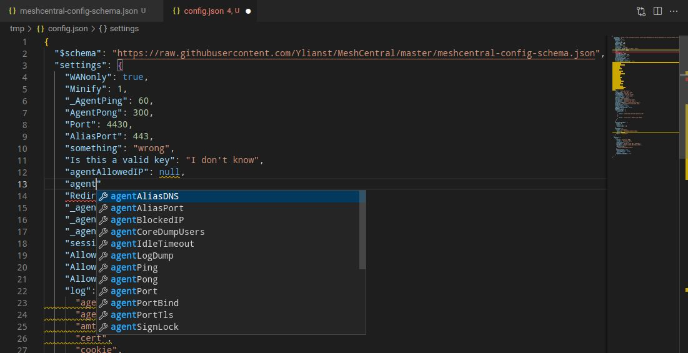

# Tips n' Tricks

## Colors in SSH

The SSH terminal does support color. The issue is going to be the terminal configuration of the shell. Try typing this:

```bash
ls -al --color /tmp
```

## Fancy config editing with VS Code

A common problem in the issues is an incorrect config.json. What makes a config incorrect? How can you verify your config is correct?

Easy! Use Visual Studio Code to edit your config.json and add the schema at the top.

If you haven't already, download VS code.
Download or copy the config.json to your computer.
Open config.json in code and add the schema as the top line. This schema is the raw JSON file in the MeshCentral repo.

```json
{
  "$schema": "https://raw.githubusercontent.com/Ylianst/MeshCentral/master/meshcentral-config-schema.json",
  "settings": {
    "your settings go here": "..."
  }
}
```

Now you have autocomplete, auto-format and validation for your config.json! If you start typing, Code will show the values that are valid for the location you are editing. Words with a red squiggle line are errors. Words with a orange squiggle line are warnings. Hover over both to see the error message and possible fixes. Code can even format your config.

While this is a huge step up, it's not perfect. If you notice, there are some invalid keys in the screenshot. This is perfectly valid JSON and MeshCentral will ignore them (maybe?). If you paste some configs into the wrong section, code will not tell you it's in the wrong section. Autocomplete will tell you what keys are valid and the type of the value (i.e. string, number, boolean).

Hopefully this will help verify your config is syntactically correct and prevent needless formatting errors, misspellings, etc.



## Downloading Folders

If you would like to download folders via Files simply select folder/files then use the zip and download the zip file by clicking on it.

## Share device groups with AD logins
If you would like to share device groups with different AD users.

In the config.json set "ldapuserkey" to "sAMAccountName".

## Docker Password Resets (If Locked Out from the Web GUI)

If you lose access to your MeshCentral instance due to a locked or forgotten admin account but still have shell access to your Docker containers, you can safely reset the credentials. This is performed while the containers are running dont shut the containers down!

### Steps

**1. Access the MeshCentral container shell**

Open a shell session inside your MeshCentral container.

**2. Navigate to the MeshCentral directory**

```bash
cd /opt/meshcentral
```

> ⚠️ **Note:** The path is case-sensitive YOURS MIGHT BE DIFFERENT!

**3. (Optional) View available CLI commands**

```bash
node meshcentral --help
```

**4. Reset the account credentials**

```bash
node meshcentral --resetaccount 'email//user' --pass 'newtemporarypassword'
```

Replace `email//user` with either:
- The user's **email address** (if that is their login identifier), or
- The user's **userID** (if they do not log in with an email)

Also ensure the new password complies with any password complexity rules defined in your `config.json`.

**5. Verify the output**

- ✅ A `done` response indicates success.
- ❌ An error response will help narrow down the issue (wrong username format, password policy violation, etc.).

**6. Restart the containers**

Restart the MeshCentral container and, if applicable, its associated database container, or stack if you have stacks in a tool:

```bash
docker restart <meshcentral-container-name>
docker restart <database-container-name>
```

---

### ⚠️ Security Considerations

- This process **will reset 2FA** for the affected account.
- Because this operation requires direct container access, **restrict shell/container access as much as possible** to limit exposure.
